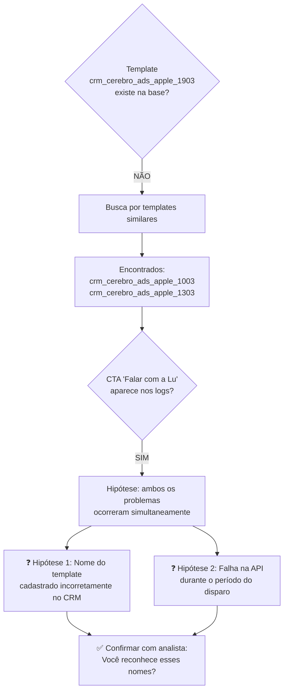
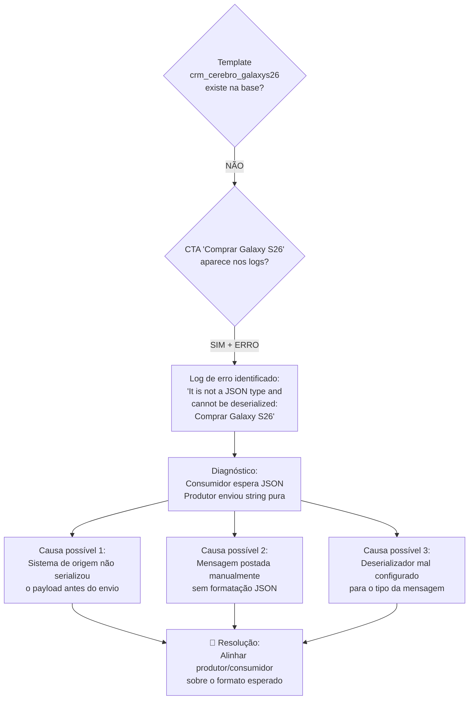
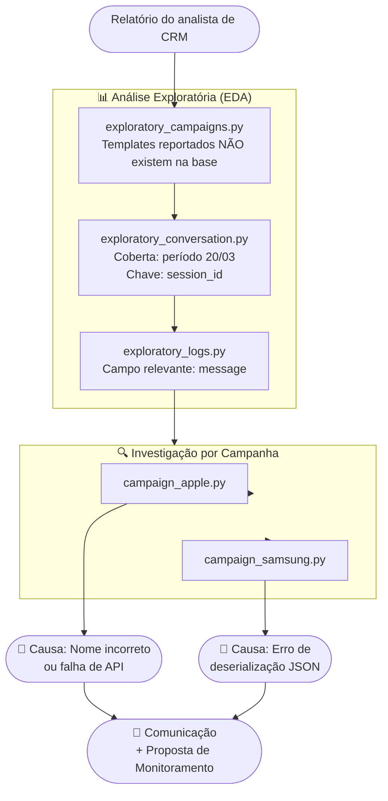

# 🔍 CRM Messaging Investigation

> **Estudo de caso:** Investigação de campanhas de mensageria (WhatsApp) ausentes no dashboard de CRM — identificação de causa raiz, comunicação ao stakeholder e proposta de monitoramento proativo.

---

## 📋 Contexto do Problema

Na manhã do dia **20/03**, o analista de CRM reportou que duas campanhas não estavam aparecendo no dashboard de acompanhamento:

| Campanha | Data do Disparo | Send Type | Template Informado | CTA |
|---|---|---|---|---|
| 🍎 Apple | 19/03 | 835 | `crm_cerebro_ads_apple_1903` | "Falar com a Lu" |
| 📱 Samsung Galaxy S26 | 20/03 | 838 | `crm_cerebro_galaxys26` | "Comprar Galaxy S26" |

> *"Bom dia, gente! Não identifiquei na dash os disparos de Apple e Samsung que fizemos dias 19/03 e 20/03, respectivamente. Podem ver se o painel quebrou ou o que aconteceu?"*
> — Analista de CRM

---

## 🛠️ Stack Tecnológica


| Categoria | Ferramenta |
|---|---|
| Linguagem | Python (via pyenv) |
| Análise de dados | Pandas, DuckDB |
| Gerenciamento de pacotes | Poetry |
| Qualidade de código | Black, isort |
| Editor | VS Code + Jupyter (`# %%`) + CSV ReprEng |
| Versionamento de scripts | `.py` (não `.ipynb`) |

> **Por que `.py` e não `.ipynb`?**  
> Arquivos `.py` com células `# %%` são melhor rastreados pelo Git — diffs legíveis, sem conflitos de metadados de notebook.

---

## 📁 Estrutura do Projeto

```
.
├── crm_messaging_investigation/
│   ├── data/
│   │   ├── campanhas.json              ← Fonte 1: configurações das campanhas
│   │   ├── conversas.json              ← Fonte 2: mensagens trocadas
│   │   ├── logs_omnichannel.csv        ← Fonte 3: logs de infraestrutura
│   │   └── data_processed/            ← Outputs intermediários da análise
│   │       ├── campanhas_processadas.csv
│   │       ├── conversas_com_campanhas.csv
│   │       ├── conversas_processadas.csv
│   │       ├── df_logs_amostra.csv
│   │       ├── log_samsung_s26.csv
│   │       ├── logs_tratados.csv
│   │       └── templates_parecidos_apple.csv
│   ├── functions/
│   │   ├── __init__.py
│   │   └── utils.py                   ← Funções reutilizáveis
│   ├── investigation_campaigns/
│   │   ├── campaign_apple.py          ← Investigação Apple
│   │   └── campaign_samsung.py        ← Investigação Samsung
│   └── raw_exploratory_bases/
│       ├── exploratory_campaigns.py   ← EDA: campanhas
│       ├── exploratory_conversation.py ← EDA: conversas
│       └── exploratory_logs.py        ← EDA: logs omnichannel
├── Makefile
├── poetry.lock
├── pyproject.toml
├── README.md
└── tests/
    └── __init__.py
```

---

## 🗃️ Fontes de Dados

### Modelo de Relacionamento

```mermaid
erDiagram
    CAMPANHAS {
        string session_id PK
        string message_id
        string template
        string source
        string channel_client_id
        timestamp publish_time
        string ctwa_clid
        string version
    }

    CONVERSAS {
        string session_id FK
        string message_id
        string text
        string author
        string user_id
        string media_type
        timestamp publish_time
    }

    LOGS_OMNICHANNEL {
        string message
    }

    CAMPANHAS ||--o{ CONVERSAS : "session_id"
    CAMPANHAS ..o{ LOGS_OMNICHANNEL : "rastreio via texto"
```

> ⚠️ **Atenção:** A relação `campanhas → conversas` via `session_id` pode gerar duplicidade (N:M) se não tratada corretamente no modelo do dashboard. Uma mesma `session_id` pode conter múltiplos `message_id` distintos.

### Dicionário — Campanhas

| Campo | Descrição | Relevância |
|---|---|---|
| `session_id` | Identificador único da sessão de envio | 🔑 Alta |
| `template` | Nome técnico do modelo de mensagem aprovado | 🔑 Alta |
| `publish_time` | Timestamp do processamento pelo sistema | 🔑 Alta |
| `channel_client_id` | Identificador do destinatário no canal | Média |
| `source` | Origem do disparo (`crm`, Meta, etc.) | Média |
| `ctwa_clid` | Click ID de anúncio WhatsApp (nulo = disparo direto) | Baixa |
| `message_id` | ID único do evento gerado pelo provedor | Baixa |
| `attributes` | Metadados em JSON (flags, categorias) | Baixa |
| `data` | Payload bruto reservado (geralmente nulo) | Baixa |
| `version` | Versão do template/esquema | Baixa |

### Dicionário — Conversas

| Campo | Descrição | Relevância |
|---|---|---|
| `session_id` | Chave de amarração com a tabela de campanhas | 🔑 Alta |
| `text` | Conteúdo da mensagem | 🔑 Alta |
| `publish_time` | Timestamp UTC de publicação | 🔑 Alta |
| `message_id` | ID interno da conversa (≠ `message_id` de campanhas) | Média |
| `media_type` | Formato da mensagem (`text`, `image`, `audio`) | Baixa |
| `author` | Quem enviou a mensagem | Baixa |
| `user_id` | Equivalente ao `channel_client_id` de campanhas | Baixa |

---

## 🔬 Metodologia

A investigação seguiu as fases do **CRISP-DM** adaptadas ao contexto:


### Fases


---

## 🕵️ Investigação — Resultados por Campanha

### 🍎 Campanha Apple (Send Type 835 — 19/03)



**Achados:**
- Os templates `crm_cerebro_ads_apple_1903` (informado) **não foram encontrados** na base de campanhas.
- Templates com nomes parecidos foram localizados: `crm_cerebro_ads_apple_1003` e `crm_cerebro_ads_apple_1303`.
- O CTA `"Falar com a Lu"` **aparece nos logs**, sugerindo que ao menos parte do disparo foi processada.

**Causa raiz:** Indefinida — pode ser erro de cadastro do template (typo na data) **ou** falha sistêmica na API, ou ambos. Necessita confirmação do analista.

---

### 📱 Campanha Samsung Galaxy S26 (Send Type 838 — 20/03)



**Achados:**
- O template `crm_cerebro_galaxys26` **não existe na base** — a campanha nunca foi registrada.
- Nos logs omnichannel, foi identificado o seguinte erro associado ao CTA informado:

```
It is not a JSON type and cannot be deserialized: Comprar Galaxy S26 e...
```

- Alguns disparos chegaram a ser iniciados, mas **falharam na camada de processamento** por incompatibilidade de formato.

**Causa raiz:** Erro de comunicação entre sistemas — o consumidor esperava um objeto JSON estruturado, mas recebeu uma string de texto puro. O template também não estava cadastrado no CRM.

---

## 📊 Resumo Comparativo

| | 🍎 Apple (19/03) | 📱 Samsung Galaxy S26 (20/03) |
|---|---|---|
| **Template existia na base?** | ❌ Não | ❌ Não |
| **Campanha cadastrada?** | ❓ Possivelmente com nome errado | ❌ Não registrada |
| **Evidência nos logs?** | ✅ CTA encontrado | ✅ Erro de deserialização |
| **Mensagens disparadas?** | Parcialmente (indício) | Parcialmente (com falha) |
| **Causa raiz** | Typo no nome do template e/ou falha de API | Campanha não registrada + erro de payload JSON |
| **Ação necessária** | Confirmar com analista o nome correto | Corrigir serialização do payload |

---
# 🔍 CRM Messaging Investigation

> **Estudo de caso:** Investigação de campanhas de mensageria (WhatsApp) ausentes no dashboard de CRM — identificação de causa raiz, comunicação ao stakeholder e proposta de monitoramento proativo.

---

## 📋 Contexto do Problema

Na manhã do dia **20/03**, o analista de CRM reportou que duas campanhas não estavam aparecendo no dashboard de acompanhamento:

| Campanha | Data do Disparo | Send Type | Template Informado | CTA |
|---|---|---|---|---|
| 🍎 Apple | 19/03 | 835 | `crm_cerebro_ads_apple_1903` | "Falar com a Lu" |
| 📱 Samsung Galaxy S26 | 20/03 | 838 | `crm_cerebro_galaxys26` | "Comprar Galaxy S26" |

> *"Bom dia, gente! Não identifiquei na dash os disparos de Apple e Samsung que fizemos dias 19/03 e 20/03, respectivamente. Podem ver se o painel quebrou ou o que aconteceu?"*
> — Analista de CRM

---

## 🛠️ Stack Tecnológica


| Categoria | Ferramenta |
|---|---|
| Linguagem | Python (via pyenv) |
| Análise de dados | Pandas, DuckDB |
| Gerenciamento de pacotes | Poetry |
| Qualidade de código | Black, isort |
| Editor | VS Code + Jupyter (`# %%`) + CSV ReprEng |
| Versionamento de scripts | `.py` (não `.ipynb`) |

> **Por que `.py` e não `.ipynb`?**  
> Arquivos `.py` com células `# %%` são melhor rastreados pelo Git — diffs legíveis, sem conflitos de metadados de notebook.

---

## 📁 Estrutura do Projeto

```
.
├── crm_messaging_investigation/
│   ├── data/
│   │   ├── campanhas.json              ← Fonte 1: configurações das campanhas
│   │   ├── conversas.json              ← Fonte 2: mensagens trocadas
│   │   ├── logs_omnichannel.csv        ← Fonte 3: logs de infraestrutura
│   │   └── data_processed/            ← Outputs intermediários da análise
│   │       ├── campanhas_processadas.csv
│   │       ├── conversas_com_campanhas.csv
│   │       ├── conversas_processadas.csv
│   │       ├── df_logs_amostra.csv
│   │       ├── log_samsung_s26.csv
│   │       ├── logs_tratados.csv
│   │       └── templates_parecidos_apple.csv
│   ├── functions/
│   │   ├── __init__.py
│   │   └── utils.py                   ← Funções reutilizáveis
│   ├── investigation_campaigns/
│   │   ├── campaign_apple.py          ← Investigação Apple
│   │   └── campaign_samsung.py        ← Investigação Samsung
│   └── raw_exploratory_bases/
│       ├── exploratory_campaigns.py   ← EDA: campanhas
│       ├── exploratory_conversation.py ← EDA: conversas
│       └── exploratory_logs.py        ← EDA: logs omnichannel
├── Makefile
├── poetry.lock
├── pyproject.toml
├── README.md
└── tests/
    └── __init__.py
```

---

## 🗃️ Fontes de Dados

### Modelo de Relacionamento

```mermaid
erDiagram
    CAMPANHAS {
        string session_id PK
        string message_id
        string template
        string source
        string channel_client_id
        timestamp publish_time
        string ctwa_clid
        string version
    }

    CONVERSAS {
        string session_id FK
        string message_id
        string text
        string author
        string user_id
        string media_type
        timestamp publish_time
    }

    LOGS_OMNICHANNEL {
        string message
    }

    CAMPANHAS ||--o{ CONVERSAS : "session_id"
    CAMPANHAS ..o{ LOGS_OMNICHANNEL : "rastreio via texto"
```

> ⚠️ **Atenção:** A relação `campanhas → conversas` via `session_id` pode gerar duplicidade (N:M) se não tratada corretamente no modelo do dashboard. Uma mesma `session_id` pode conter múltiplos `message_id` distintos.

### Dicionário — Campanhas

| Campo | Descrição | Relevância |
|---|---|---|
| `session_id` | Identificador único da sessão de envio | 🔑 Alta |
| `template` | Nome técnico do modelo de mensagem aprovado | 🔑 Alta |
| `publish_time` | Timestamp do processamento pelo sistema | 🔑 Alta |
| `channel_client_id` | Identificador do destinatário no canal | Média |
| `source` | Origem do disparo (`crm`, Meta, etc.) | Média |
| `ctwa_clid` | Click ID de anúncio WhatsApp (nulo = disparo direto) | Baixa |
| `message_id` | ID único do evento gerado pelo provedor | Baixa |
| `attributes` | Metadados em JSON (flags, categorias) | Baixa |
| `data` | Payload bruto reservado (geralmente nulo) | Baixa |
| `version` | Versão do template/esquema | Baixa |

### Dicionário — Conversas

| Campo | Descrição | Relevância |
|---|---|---|
| `session_id` | Chave de amarração com a tabela de campanhas | 🔑 Alta |
| `text` | Conteúdo da mensagem | 🔑 Alta |
| `publish_time` | Timestamp UTC de publicação | 🔑 Alta |
| `message_id` | ID interno da conversa (≠ `message_id` de campanhas) | Média |
| `media_type` | Formato da mensagem (`text`, `image`, `audio`) | Baixa |
| `author` | Quem enviou a mensagem | Baixa |
| `user_id` | Equivalente ao `channel_client_id` de campanhas | Baixa |

---

## 🔬 Metodologia

A investigação seguiu as fases do **CRISP-DM** adaptadas ao contexto:


### Fases



---

## 🕵️ Investigação — Resultados por Campanha

### 🍎 Campanha Apple (Send Type 835 — 19/03)


**Achados:**
- Os templates `crm_cerebro_ads_apple_1903` (informado) **não foram encontrados** na base de campanhas.
- Templates com nomes parecidos foram localizados: `crm_cerebro_ads_apple_1003` e `crm_cerebro_ads_apple_1303`.
- O CTA `"Falar com a Lu"` **aparece nos logs**, sugerindo que ao menos parte do disparo foi processada.

**Causa raiz:** Indefinida — pode ser erro de cadastro do template (typo na data) **ou** falha sistêmica na API, ou ambos. Necessita confirmação do analista.

---

### 📱 Campanha Samsung Galaxy S26 (Send Type 838 — 20/03)


**Achados:**
- O template `crm_cerebro_galaxys26` **não existe na base** — a campanha nunca foi registrada.
- Nos logs omnichannel, foi identificado o seguinte erro associado ao CTA informado:

```
It is not a JSON type and cannot be deserialized: Comprar Galaxy S26 e...
```

- Alguns disparos chegaram a ser iniciados, mas **falharam na camada de processamento** por incompatibilidade de formato.

**Causa raiz:** Erro de comunicação entre sistemas — o consumidor esperava um objeto JSON estruturado, mas recebeu uma string de texto puro. O template também não estava cadastrado no CRM.

---

## 📊 Resumo Comparativo

| | 🍎 Apple (19/03) | 📱 Samsung Galaxy S26 (20/03) |
|---|---|---|
| **Template existia na base?** | ❌ Não | ❌ Não |
| **Campanha cadastrada?** | ❓ Possivelmente com nome errado | ❌ Não registrada |
| **Evidência nos logs?** | ✅ CTA encontrado | ✅ Erro de deserialização |
| **Mensagens disparadas?** | Parcialmente (indício) | Parcialmente (com falha) |
| **Causa raiz** | Typo no nome do template e/ou falha de API | Campanha não registrada + erro de payload JSON |
| **Ação necessária** | Confirmar com analista o nome correto | Corrigir serialização do payload |

---
